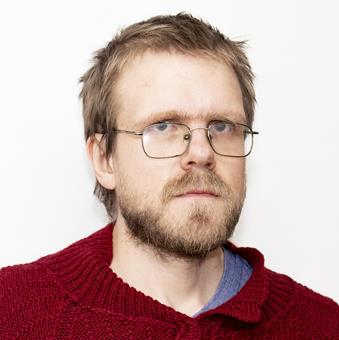

# Daniel Lännström, PhD
## Data Scientist

Data scientist with a background in theoretical mathematics with connections to quantum physics. Pasionate about learning and teaching. I thrive in a fast-paced environment where I am constantly learning about new techniques.
